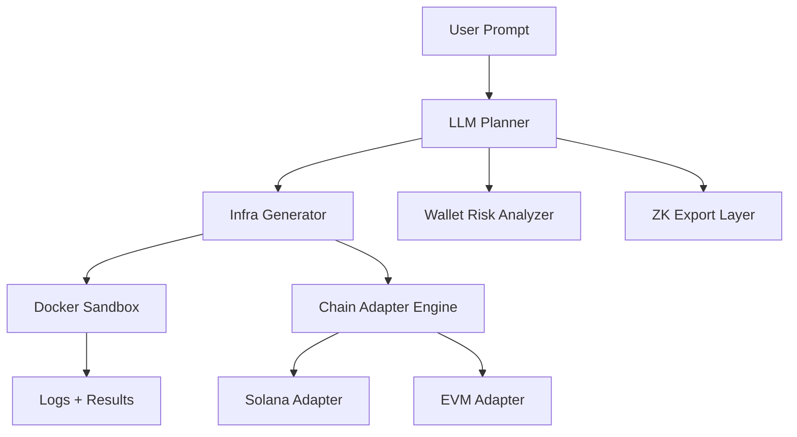

# Zeus – Autonomous Web3 Deployment Agent

Zeus is a **Python-powered AI framework** that converts plain-language intents into reproducible, verifiable Web3 infrastructure.  
It combines local LLM planning, Solana adapters, cryptographic state proofs, and container-based simulation, all orchestrated from a lightweight CLI.

---

## ✨ Key Highlights

- **Prompt → Infra-as-Code** – generate Docker / Terraform / Anchor stacks  
- **Cryptographic audit trail** – every blueprint is hash-linked and signed  
- **Local dry-run** – Docker sandbox validates before on-chain action  
- **Multi-chain ready** – Solana included; EVM & Cosmos adapters pluggable  
- **Optional zk-proof export** – produce SNARKs of deployment metadata  

---

### 🔁 Zeus Flow Diagram

Zeus Flow Diagram



---

## 🗂 Folder Structure

```txt
zeus/
├── cli/                  # Terminal commands
├── planner/              # LLM-based intent → infra planning
├── sandbox/              # Docker executor
├── adapters/
│   ├── solana/           # Solana logic + risk analysis
│   └── evm/              # EVM/Hardhat integration (WIP)
├── zk/                   # zk-SNARK integration (planned)
├── docs/                 # Markdown + Mermaid logs
├── tests/                # Unit and integration tests
├── requirements.txt      # Python dependencies
├── pyproject.toml        # Project metadata
└── README.md
```

---

## ⚙️ Installation

```bash
git clone https://github.com/YOUR_USER/zeus.git
cd zeus
pip install -e .
```

---

## 🔎 Example Usage

```bash
zeus deploy --intent "launch a burnable Solana token"
zeus simulate ./configs/token.json
zeus wallet-audit <WALLET_ADDRESS>
```

---

## 🧪 How It Works

1. **LLM Planner** → Converts prompts to JSON infra specs.
2. **Infra Generator** → Renders Docker/Terraform/Anchor code.
3. **Risk Analyzer** → Runs prechecks on wallet or deploys.
4. **Sandbox** → Runs dry deployment locally.
5. **Markdown Export** → Outputs documentation post-deploy.
6. *(Optional)* **zk-Attestations** → Exports verifiable deployment hash.

---

## 🔐 Security

- All agents run locally by default
- No GPT/OpenAI API dependencies
- zk-proof layer prevents tampering (WIP)
- Docker isolation for deploys

---

## 🛠 Dev Notes

- Uses `Click` for CLI
- Built-in support for `solana-py`
- Future support: `Zokrates`, `Cosmos SDK`, `Hardhat`

---

## 🧭 Roadmap

| Version | Highlights | ETA |
|---------|------------|-----|
| v0.5 | Solana deployer + CLI agent | Q3 2025 |
| v0.6 | zk-proof + multi-chain | Q4 2025 |
| v1.0 | Full adapter engine + Cosmos support | Q2 2026 |
| v2.0 | Onchain agent registry + UI | 2027 |

---

## 📌 Contributing

We welcome PRs!

```bash
# Typical PR flow
git checkout -b feat/<feature-name>
# make changes
pytest && black . && pre-commit run
# then push and PR
```

Use `good first issue` and `help wanted` labels.

---

## 📄 License

MIT © 2025 crusagcomhe

> Built for the world. Run by agents. Made in story.
